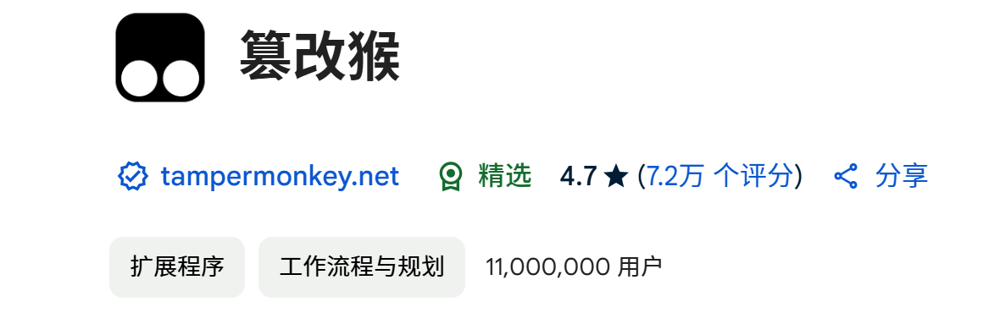
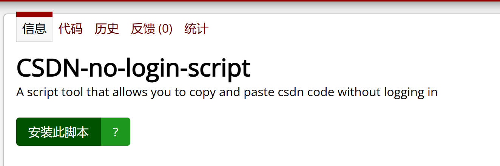

# CSDN-no-login-script
A script tool that allows you to copy and paste csdn code without logging in
使用教程：
## 1.下载油猴插件：
[油猴插件：](https://chromewebstore.google.com/detail/dhdgffkkebhmkfjojejmpbldmpobfkfo?utm_source=item-share-cp)

## 2.打开Greasy Fork
链接直达：https://greasyfork.org/zh-CN/scripts/528431-csdn-no-login-script
## 3.Install
点击安装此脚本即可使用。
